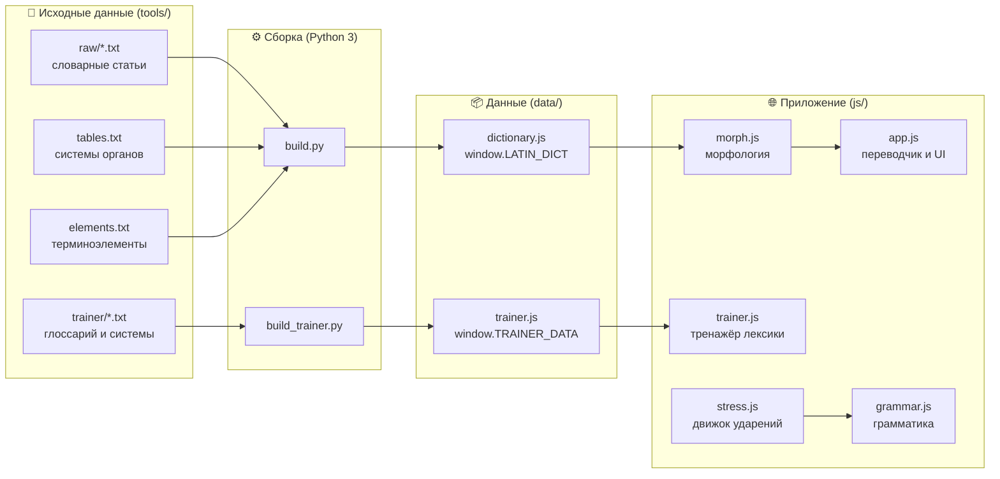

<div align="center">

# 🏛️ Lingua Latina *medicinalis*

### Медицинская латынь — просто, наглядно и без лишней боли

**Учебная платформа для студентов Сахалинского базового медицинского колледжа (СБМК)**

*Переводчик · Словарь · Грамматика · Тренажёры*


</div>

---

## 👤 Об авторе

Проект создаёт **Вадим «qu0tas»** — студент, которому однажды надоело листать три словаря, чтобы перевести одну строчку рецепта.

## 🎯 Идея

Латынь в медколледже — это сотни терминов, пять склонений, рецептурные сокращения и правила ударения, которые нужно выучить за один семестр.
**Lingua Latina medicinalis** делает это проще:

- 🔎 **всё в одном месте**: словари двух учебников и глоссарий колледжа собраны в общую базу;
- 🧠 **сайт объясняет, а не просто отвечает**: показывает падеж, склонение, разбор по терминоэлементам и правило, по которому ставится ударение;
- 🎮 **учить можно через практику**: тренажёры с проверкой, разбором ошибок и повторением слабых мест;
- 📚 **ответы совпадают с учебником**: сайт переводит только по словарям учебников и ничего не выдумывает.

## 🚀 Будущее проекта

Сейчас это латынь. Дальше — больше.

Цель — вырасти в **большую учебную платформу СБМК**, где в одном месте можно будет готовиться к разным предметам:

| Этап | Направление | Статус |
| :--: | --- | :--: |
| 1 | 🏛️ **Латинский язык с медицинской терминологией** | ✅ работает |
| 2 | 🦴 **Анатомия**: атлас, латинские названия структур, тренажёры по системам органов | 🛠️ в планах |
| 3 | 💊 **Фармакология**: группы препаратов, рецептура, частотные отрезки | 🛠️ в планах |
| 4 | 🩺 **Другие дисциплины** колледжа | 💡 идеи |

Многое для этого уже есть: таблицы систем органов, терминоэлементы и словарь служат основой для будущих разделов.

---

## ✨ Возможности

<table>
<tr><td width="50%" valign="top">

### 🔄 Переводчик латынь ⇄ русский
- Слова распознаются **в любой форме**: *cordis, venarum, tabulettas*
- Падеж выбирается **по контексту**: *in vena dextra* → «в вене правой»
- Прилагательное **согласуется** с существительным в роде, числе и падеже
- Целиком распознаются **устойчивые сочетания**, **рецептурные сокращения** (*Rp., D.t.d., M.D.S.*) и **афоризмы**
- Если слова нет в словаре, сайт может **подсказать разбор по терминоэлементам** (*gastr- + -itis*), но не выдаёт его за перевод
- 🔊 **Произношение**: транскрипция по правилам чтения глоссария (*solutio* → [солю́цио]) и озвучка голосом устройства
- 📷 **Перевод по фото** *(тестовая функция)*: распознавание печатного текста прямо в браузере, фото никуда не отправляется

</td><td width="50%" valign="top">

### 📖 Словарь
- **3054 статьи** с указанием источника
- Поиск по-латински и по-русски, **по любой падежной форме**
- **Таблицы склонения и спряжения** по клику на слово
- Фильтр по буквам алфавита

### 🧩 Терминоэлементы
- Приставки, числительные-приставки, греческие корни
- Частотные отрезки в названиях лекарств
- Таблицы по системам органов

</td></tr>
<tr><td valign="top">

### 📐 Грамматика
- Правила чтения: алфавит, дифтонги, диграфы
- Правила ударения: долгота и краткость слога
- **Проверка слова**: деление на слоги, ударение и пошаговое объяснение

</td><td valign="top">

### 🎯 Тренажёры
- **Лексика**: 29 тем глоссария, словосочетания (задания 2.5.5, 3.9.3) и 6 систем органов; сначала каждое слово по разу, затем дополнительные повторения, проверка сразу или в конце, статистика по темам
- **Голосовой режим**: слово не показывается — его произносит диктор (русское или латинское), плюс **диктант** «слышу латынь — пишу по-латински»
- **Ударения**: 112 основных слов + 2 120 слов из словаря; нажмите на ударный слог; при ошибке сайт покажет правильный вариант и объяснит, по какому правилу ставится ударение
- Повторение ошибок одной кнопкой

</td></tr>
</table>

---

## 📚 Источники данных

| Источник | Что взято | Статей |
| --- | --- | --: |
| В.И. Кравченко, «Латинский язык для медицинских колледжей и училищ» | латинско-русский словарь (с. 327–363), таблицы терминоэлементов | 1590 |
| Ю.И. Городкова, «Латинский язык (для медицинских и фармацевтических колледжей и училищ)», КНОРУС, 2017 | словарь (с. 221–244), слова, которых нет у Кравченко | 1153 |
| Глоссарий СБМК, 2026 | термины, препараты, растения, числительные | 138 |
| Глоссарий СБМК, 2026 | рецептурные сокращения | 32 |
| Глоссарий СБМК, 2026 | афоризмы | 141 |

Дополнительно: **113** строк таблиц систем органов, **119** терминоэлементов, **943** карточки тренажёра из глоссария и **119** строк таблиц систем органов для тренажёра.

---

## 🏗️ Архитектура

Проект — **статическое веб-приложение без сервера, сборщиков и внешних библиотек**. Всё работает в браузере, в том числе без интернета.
Данные хранятся в простых текстовых файлах и компилируются в JS-модули скриптами на Python.



### 📁 Структура репозитория

```
latin-sbmk/
├── index.html                 # единственная страница: вкладки, панели, подключение модулей
├── css/
│   └── style.css              # дизайн-система: CSS-переменные, светлая и тёмная тема, адаптивная вёрстка
├── js/
│   ├── morph.js               # морфологический движок
│   ├── app.js                 # переводчик, словарь, терминоэлементы, навигация
│   ├── trainer.js             # тренажёр лексики
│   ├── stress.js              # слоги, долгота и ударение с объяснением
│   ├── grammar.js             # раздел «Грамматика» и тренажёр ударений
│   ├── speech.js              # транскрипция и озвучка (Web Speech API)
│   └── photo.js               # перевод по фото (тестовая функция)
├── audio/                     # записи диктора (Silero TTS, голос kseniya), ~34 МБ
├── vendor/tesseract/          # Tesseract.js 5 (Apache-2.0) и модель латыни — распознавание текста в браузере
├── data/
│   ├── dictionary.js          # скомпилированный словарь (генерируется)
│   └── trainer.js             # скомпилированные списки тренажёра (генерируется)
└── tools/
    ├── build.py               # компилятор словаря → data/dictionary.js
    ├── build_trainer.py       # компилятор тренажёра → data/trainer.js
    ├── raw/
    │   ├── p327.txt … p363.txt   # словарь Кравченко, по одному файлу на страницу
    │   ├── g_gorodkova.txt       # словарь Городковой
    │   ├── s_glossary.txt        # термины глоссария СБМК
    │   ├── s_abbr.txt            # рецептурные сокращения
    │   └── s_aphorisms.txt       # афоризмы
    ├── tables.txt             # таблицы систем органов
    ├── elements.txt           # приставки и терминоэлементы
    └── trainer/
        ├── glossary.txt       # темы глоссария для тренажёра
        └── systems.txt        # системы органов для тренажёра
```

---

## ⚙️ Техническая часть

### 1. Морфологический движок — `js/morph.js`

Сердце переводчика. По словарной записи (*abdomen, -inis, n*) строит **полную парадигму слова**.

- **Анализ статьи** (`analyzeEntry`): определяет часть речи по грамматической пометке: существительное, прилагательное (1–2 и 3 склонения, сравнительная степень), глагол (I–IV спряжения), предлог (с управлением *Acc./Abl.*), наречие, неизменяемое слово, словосочетание.
- **Присоединение окончаний** (`joinEnding`): восстанавливает полную форму родительного падежа: *abdomen + -inis → abdominis*, *venter + -tris → ventris*, *regio + -onis → regionis*.
- **Склонение** (`nounParadigm`, `adj12`, `adj3`): все 5 склонений, слова только во множественном числе, греческие типы, среднеродовые исключения. Например, *Nom. = Acc.* и *-ia* во мн. ч. для 3-го склонения.
- **Спряжение** (`verbForms`): 4 спряжения, формы настоящего времени изъявительного и сослагательного наклонения в действительном и страдательном залоге, повелительное наклонение, причастия. Покрыты рецептурные формы: *misce, misceatur, signetur, sterilisetur*.
- **Русская морфология**: стеммер **Snowball** для русского языка, определение падежа по окончанию существительных и прилагательных, построение нужной русской формы (`ruNounForm`, `ruAdjForm`) с учётом беглых гласных (*кашель → кашля*, *позвонок → позвонка*).
- **Нормализация**: долгота и диакритика, *æ/œ → ae/oe*, *j → i*, *ё → е*.

### 2. Переводчик — `js/app.js`

- **Индекс словоформ** `laIndex`: при загрузке для каждой статьи генерируются все формы, и каждая сохраняется в `Map` *форма → [статья, падеж, число]*. Поиск любой формы — O(1).
- **Распознавание фраз** (`matchPhraseAt`): жадный поиск самых длинных совпадений. Слова фразы сравниваются «мягко» (`softEq`: общая лемма или общая основа), а **рецептурные сокращения** — строго, токен в токен.
- **Разрешение контекста** (`resolveLa`): предлоги задают падеж (*in + Abl.* → предложный, *in + Acc.* → винительный), существительное в *Gen.* после другого существительного переводится родительным, прилагательное согласуется с ближайшим существительным.
- **Русский → латынь** (`translateRu`, `buildLatin`): поиск по основам Snowball, ранжирование кандидатов, согласование прилагательного с существительным в роде, числе и падеже. Определение в латинском ставится после определяемого слова.
- **Терминоэлементный разбор** (`decompose`): динамическое программирование по префиксам слова. Ищется разбиение на минимальное число элементов с учётом соединительных гласных *-o-*, *-i-* и окончаний.
- **Словарь**: поиск по подстроке, по русским основам и по распознанной латинской форме одновременно; список подгружается частями.

### 3. Движок ударений — `js/stress.js`

Полностью реализует таблицу №3 глоссария «Долгота и краткость слога».

1. **Разбор на токены**: дифтонги *ae, oe, au, eu* (с исключениями *aë, oë* и *-eus/-eum* на стыке суффикса и окончания), диграфы *ch, ph, rh, th* как один звук, *qu*, *ngu* перед гласным, начальное *i* перед гласным как [й], знаки природной долготы ¯ и краткости ˘ (Unicode, в том числе комбинируемые U+0304 и U+0306).
2. **Слогоделение**: V-CV, VC-CV, а группа «немой + плавный» (*b, p, t, d, c, g, f + l, r*) уходит в следующий слог: *e-phe-dra*, *re-fle-xus*.
3. **Долгота 2-го слога от конца**, правила по приоритету:
   природная долгота или краткость → дифтонг → гласный перед гласным → *x/z* → «немой + плавный» → две и более согласных → суффиксы (*-āl-, -ār-, -āt-, -īn-, -īv-, -ōs-, -ūr-, -ūt-, -itis, -oma, -iasis* / *-ĭc-, -ĭd-, -ĭl-, -ŏl-, -ŭl-*).
4. **Объяснение**: для каждого слова строится пошаговый вывод на русском языке. Если долготу нельзя определить по правилам, движок честно сообщает об этом и показывает оба варианта.
5. **Отображение**: ударение ставится знаком U+0301 над нужной буквой. В дифтонгах *ae/oe* знак стоит над второй гласной, как в глоссарии: *la-goé-na*.

### 4. Тренажёры — `js/trainer.js`, `js/grammar.js`

- **Лексика**: выбор тем, режим изучения со скрытием колонок, колода: сначала каждое слово ровно один раз, затем случайные повторения с упором на ошибки, русский ответ принимается при любом порядке слов, проверка с учётом вариантов ответа (`;`, скобки, грамматика необязательна), допуск опечатки в одну букву (расстояние Левенштейна), статистика по темам, повторение ошибок.
- **Ударения**: 112 слов в 9 группах по правилам и слова из словаря переводчика, для которых правило даёт однозначный ответ (частые исключения вроде *Urtīca*, *trigemĭnus* исправлены вручную). Ответ — клик по слогу. Объяснение ошибки зависит от того, что выбрал студент: последний слог, слишком далёкий слог, перепутанные долгий и краткий слоги. Итоги показываются по каждому правилу.
- Настройки сохраняются в `localStorage` (`sbmk-trainer-v1`, `sbmk-stress-v1`).

### Произношение — `js/speech.js`

- Латинское слово переводится в русскую транскрипцию по таблицам №1–2 глоссария: *c* → [ц]/[к], *s* между гласными → [з], *ti* + гласный → [ци], мягкое *l*, *qu* → [кв], *ngu* + гласный → [нгв], дифтонги и диграфы.
- Ударение берётся из движка `stress.js`; знаки долготы подхватываются и в других формах слова (*Valeriāna* → *Valeriānae*). Если ударение по правилам определить нельзя, знак не ставится.
- Слова словаря и тренажёров (6 326 фраз) заранее озвучены нейросетью **Silero TTS**, голос *kseniya*: `audio/xx/<fnv1a>.mp3`, индекс — `data/audio.js`. Фраза, которой нет целиком, собирается из записей отдельных слов. Остальной текст читает встроенный голос устройства (Web Speech API).
- Доозвучить новые слова: `node tools/audio/collect.js`, затем `python3 tools/audio/gen.py` (озвучиваются только новые фразы). Кнопки 🔊: переводчик, словарь, правила, «Проверить слово», тренажёры.

### Перевод по фото — `js/photo.js` *(тестовая функция)*

- Распознавание — [Tesseract.js](https://github.com/naptha/tesseract.js) 5 (WebAssembly), файлы лежат в `vendor/tesseract` и грузятся только при первом нажатии «Фото»; модель латыни кэшируется в IndexedDB.
- Перед распознаванием фото переводится в оттенки серого и растягивается по контрасту.
- После распознавания: склейка переносов, разбиение по нумерации «1)», «2)» и «;», удаление строк без слов из словаря (русские заголовки, мусор), исправление ошибок по словарю сайта (расстояние Левенштейна, *rn → m*, слова, обрезанные краем фото).
- Каждая строка переводится отдельно.

### 5. Интерфейс — `index.html`, `css/style.css`

- Одна страница с вкладками и навигацией по `#hash`: `#la`, `#ru`, `#dict`, `#el`, `#gram`, `#train`, `#about`.
- Дизайн-система на **CSS-переменных**, автоматическая **тёмная тема** (`prefers-color-scheme`), адаптивная вёрстка под телефоны.
- Без фреймворков, на чистом ES2020+: быстрая загрузка и никаких зависимостей, которые могут устареть.

### 6. Конвейер данных — `tools/`

**Формат словарной статьи** — одна строка:

```text
abdomen, -inis, n — живот
dexter, -tra, -trum — правый
jungo, -ere — соединять
sine — предл. с abl. без
oleum Ricini — касторовое масло
Rp. — Recipe — возьми                     (s_abbr.txt)
Dum spiro, spero — Пока дышу, надеюсь     (s_aphorisms.txt)
```

**Компиляция:**

```bash
python3 tools/build.py          # → data/dictionary.js
python3 tools/build_trainer.py  # → data/trainer.js
```

`build.py` разбирает строки, отделяет лемму от грамматики, проставляет источник по имени файла (`pNNN` → «Кравченко, с. N», `g_` → «Городкова», `s_` → «Глоссарий СБМК») и флаги `abbr` и `whole`, подключает таблицы и терминоэлементы, а затем проверяет, что латинские слова из таблиц есть в словаре.

**Типы терминоэлементов** в `elements.txt`: `prefix` — приставки, `num` — числительные-приставки, `suffix` — терминоэлементы, `drug` — частотные отрезки в названиях препаратов.

### 7. Принципы

| Принцип | Как реализован |
| --- | --- |
| 📏 **Точность** | переводится только то, что есть в словаре; у каждой статьи указан источник |
| 🧑‍🏫 **Объяснимость** | падеж, склонение, разбор и правило ударения видны пользователю |
| 🪶 **Лёгкость** | 0 зависимостей, статические файлы, работа офлайн |
| 🧱 **Расширяемость** | данные в текстовых файлах, а модули независимы — на этой основе будут строиться анатомия и другие предметы |

---

## 📜 Лицензия

Проект распространяется по лицензии **MIT**, полный текст — в файле [`LICENSE`](LICENSE).

> Коротко: **можно всё.** Копируйте, используйте, изменяйте, публикуйте, распространяйте, встраивайте в свои проекты, в том числе коммерческие. Единственная просьба лицензии — сохранить строку об авторских правах.

<div align="center">

---

Сделано с ❤️ для студентов СБМК · Южно-Сахалинск

**© 2026 Вадим «qu0tas»**

*Per aspera ad astra* — через тернии к звёздам

</div>
